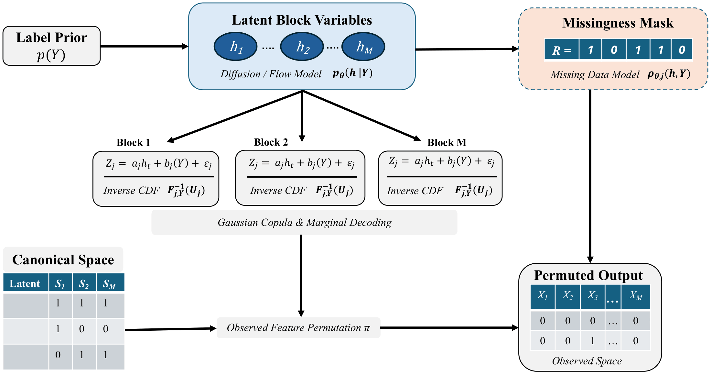

# BSTabDiff: Block-Subunit Diffusion Priors for High-Dimensional Tabular Data Generation

This repository is under construction. It will be complete soon. 


[](https://iclr.cc/virtual/2026/workshop/10000780)
[](https://openreview.net/forum?id=RKNDy0KhGT)
[](https://delta-workshop.github.io/DeLTa2026/)


<p align="center">
  
</p>

BSTabDiff is a block-subunit generative framework for **High-Dimensional Low-Sample Size (HDLSS) tabular data synthesis**. Rather than learning dependence directly in the original high-dimensional feature space, it partitions features into M ≪ m latent blocks, models global structure through a compact diffusion/flow prior over block latents, and decodes back to the full table using copula-based dependence, flexible feature-wise marginals, and explicit missingness modeling. This design makes BSTabDiff especially well suited for omics-style and other HDLSS settings, where direct high-dimensional density learning is often unstable. Across multiple HDLSS benchmarks, BSTabDiff generates more realistic and stable synthetic data than several widely used tabular generators, while often approaching downstream performance obtained from real data.

## Citation

Al Zadid Sultan Bin Habib, Md Younus Ahamed, Prashnna Kumar Gyawali, Gianfranco Doretto, and Donald A. Adjeroh.  
**“BSTabDiff: Block-Subunit Diffusion Priors for High-Dimensional Tabular Data Generation.”**  
In *ICLR 2026 2nd Workshop on Deep Generative Models in Machine Learning: Theory, Principle and Efficacy (DeLTa)*, 2026.


BibTeX:
```bibtex
@inproceedings{habib2026bstabdiff,
  title     = {BSTabDiff: Block-Subunit Diffusion Priors for High-Dimensional Tabular Data Generation},
  author    = {Habib, Al Zadid Sultan Bin and Ahamed, Md Younus and Gyawali, Prashnna Kumar and Doretto, Gianfranco and Adjeroh, Donald A.},
  booktitle = {ICLR 2026 2nd Workshop on Deep Generative Models in Machine Learning: Theory, Principle and Efficacy (DeLTa)},
  year      = {2026}
}
