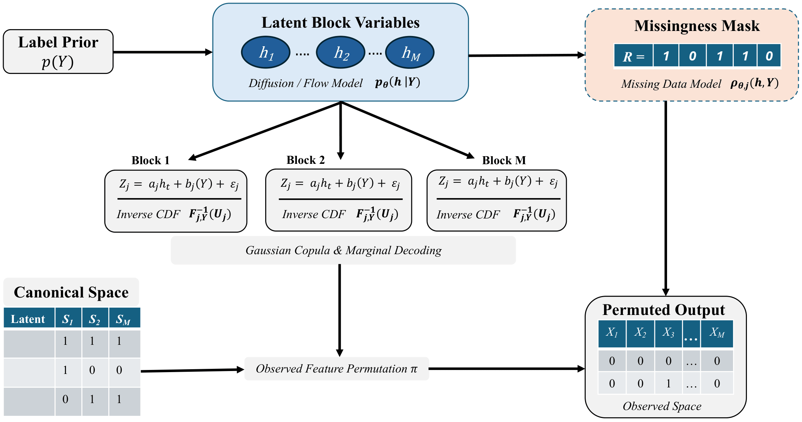

# BSTabDiff: Block-Subunit Diffusion Priors for High-Dimensional Tabular Data Generation (NeurIPS 2026)


[](https://neurips.cc/)

[](https://iclr.cc/virtual/2026/workshop/10000780)
[](https://openreview.net/forum?id=RKNDy0KhGT)
[](https://delta-workshop.github.io/DeLTa2026/)


<p align="center">
  
</p>

**This repository is under construction now, more updates will be made for the NeurIPS version**

BSTabDiff is a block-subunit generative framework for **High-Dimensional Low-Sample Size (HDLSS) tabular data synthesis**. Rather than learning dependence directly in the original high-dimensional feature space, it partitions the feature space into **M latent blocks, where M ≪ m**, models global structure through a compact diffusion/flow prior over block latents, and decodes back to the full table using copula-based dependence, flexible feature-wise marginals, and explicit missingness modeling. This design makes BSTabDiff especially well suited for omics-style and other HDLSS settings, where direct high-dimensional density learning is often unstable. Across multiple HDLSS benchmarks, BSTabDiff generates more realistic and stable synthetic data than several widely used tabular generators, while often approaching downstream performance obtained from real data.

## Citation

Al Zadid Sultan Bin Habib, Md Younus Ahamed, Prashnna Kumar Gyawali, Gianfranco Doretto, and Donald A. Adjeroh.  
**“BSTabDiff: Block-Subunit Diffusion Priors for High-Dimensional Tabular Data Generation.”**  
In *Advances in Neural Information Processing Systems (NeurIPS)*, 2026.


BibTeX:
```bibtex
@inproceedings{habib2026bstabdiff,
  title     = {BSTabDiff: Block-Subunit Diffusion Priors for High-Dimensional Tabular Data Generation},
  author    = {Habib, Al Zadid Sultan Bin and Ahamed, Md Younus and Gyawali, Prashnna Kumar and Doretto, Gianfranco and Adjeroh, Donald A.},
  booktitle = {Advances in Neural Information Processing Systems (NeurIPS)},
  year      = {2026}
}
```
- ICLR Page: https://iclr.cc/virtual/2026/10017199
- OpenReview: https://openreview.net/forum?id=RKNDy0KhGT

## Files and Repository Structure

### Python package: `bstabdiff/`

This folder contains the core BSTabDiff implementation:

- `__init__.py` - Package initializer and high-level API exports.
- `block_subunit_gen.py` - Main BSTabDiff implementation, including feature schema, empirical marginals, block-subunit emissions, diffusion/flow priors, training, and synthetic sampling utilities.

### Notebooks
**Since May 30, 2026, all Jupyter notebook previews are failing with "An error occurred" message. This affects both my own notebooks and others' repositories. Using nbformat v5.10.4 and nbconvert v7.17.1. Notebooks are valid and working locally. This appears to be a GitHub-side rendering issue.**
- See: https://github.com/orgs/community/discussions/197350

- **`Dummy Example Usage.ipynb`**  
  Contains simple toy examples showing how to install/import the `bstabdiff` package, fit BSTabDiff on a dummy HDLSS dataset, and sample synthetic data.

- **`BSTabDiff_Colon.ipynb`**  
  Contains the Colon dataset experiments from the paper. The downstream classifiers include Logistic Regression, TabPFN-2.5 (currently applicable only when the number of features is within its supported range, so Colon is eligible), TANDEM (NeurIPS 2025), and CatBoost. This notebook also includes the paper’s ablation studies and related fidelity analysis.

- **`BSTabDiff_GLI.ipynb`**  
  Contains the GLI-85 experiments using Logistic Regression as the downstream classifier, along with selected fidelity analysis.

- **`BSTabDiff_Lung.ipynb`**  
  Contains the Lung dataset experiments using Logistic Regression as the downstream classifier, along with selected fidelity analysis.

- **`BSTabDiff_PIP_Install_Check.ipynb`**
    Demonstration of BSTabDiff in a Google Colab notebook using pip installation with some toy examples.

### Other top-level files

- **`requirements.txt`** - Python dependencies required to run the BSTabDiff package and notebooks.
- **`BSTabDiffArchi.png`** - High-level architecture diagram of the BSTabDiff framework.
- **`LICENSE`** - MIT license for this repository.
- **`README.md`** - Project overview, installation, usage instructions, and citation information.
- **`.gitignore`** - Standard Git ignore rules for Python and Jupyter projects.
- **`pyproject.toml`** - Build system and packaging metadata for installation.
- **`setup.cfg`** - Package configuration and installation metadata.

### Tested Environment

- Python 3.10.13
- torch 2.9.1+cu128
- numpy 2.2.6
- pandas 2.3.3
- scikit-learn 1.7.2
- catboost 1.2.8
- tabpfn 6.3.1

## Installation

You can install **BSTabDiff** in several ways depending on your workflow.

---

### Option 1: Clone the Repository (Recommended for Development)

```bash
git clone https://github.com/zadid6pretam/BSTabDiff.git
cd BSTabDiff
pip install -r requirements.txt
pip install -e .
```

### Option 2: Install Directly from GitHub (No Cloning Needed)

```bash
pip install "git+https://github.com/zadid6pretam/BSTabDiff.git"
```

### Option 3: Use a Virtual Environment

```bash
python -m venv bstabdiff-env
source bstabdiff-env/bin/activate  # On Windows: bstabdiff-env\Scripts\activate

git clone https://github.com/zadid6pretam/BSTabDiff.git
cd BSTabDiff
pip install -r requirements.txt
pip install -e .
```

### Option 4: Local Install Without Editable Mode

```bash
git clone https://github.com/zadid6pretam/BSTabDiff.git
cd BSTabDiff
pip install -r requirements.txt
pip install .
```

### Option 5: Install from PyPI (Planned)

```bash
pip install bstabdiff
```

## Practical Configuration Rules

BSTabDiff has two main dataset-dependent structural choices:

1. the number of latent blocks, `M`;
2. whether to use **GO-BS** or **GO-BS-FC** for structure-aware feature ordering and block construction.

The following rules provide practical defaults for new datasets. They are intended as initialization guidelines rather than rigid prescriptions; users performing dataset-specific hyperparameter optimization may tune these choices directly.

### 1. Selecting the Number of Blocks `M`

Let

- `n` = number of samples,
- `m` = number of features,
- `ρ = m / n` = feature-to-sample ratio,
- `κ = n × m` = sample-feature product (total number of data cells).

For **Optuna-tuned configurations**, `M` is treated as a dataset-specific hyperparameter and can be optimized directly.

For the **default/no-tuning configuration**, BSTabDiff initializes `M` using both the HDLSS severity `ρ` and dataset scale `κ`:

```math
M=
\begin{cases}
m, & m \le 64,\\
64, & m>64 \text{ and } \rho<10,\\
\min\left(\widetilde{M}(\kappa),m\right), & \rho\ge10.
\end{cases}
```

where

```math
\widetilde M(\kappa)=
\begin{cases}
32, & \kappa < 2.5\times10^{5},\\
64, & 2.5\times10^{5}\leq\kappa<10^{6},\\
128, & 10^{6}\leq\kappa<3\times10^{6},\\
192, & \kappa\geq3\times10^{6}.
\end{cases}
```

In practical terms:

| Condition | Default `M` |
|---|---:|
| `m <= 64` | `m` |
| `m > 64` and `ρ < 10` | `64` |
| `ρ >= 10` and `κ < 2.5e5` | `32` |
| `ρ >= 10` and `2.5e5 <= κ < 1e6` | `64` |
| `ρ >= 10` and `1e6 <= κ < 3e6` | `128` |
| `ρ >= 10` and `κ >= 3e6` | `192` |

The final value is always capped by the number of available features:

```python
M = min(M, m)
```

A compact implementation is:

```python
def select_default_M(n, m):
    rho = m / n
    kappa = n * m

    if m <= 64:
        return m

    if rho < 10:
        return 64

    if kappa < 2.5e5:
        M = 32
    elif kappa < 1e6:
        M = 64
    elif kappa < 3e6:
        M = 128
    else:
        M = 192

    return min(M, m)
```

This rule is designed as a practical initialization. If block coherence or held-out validation utility stabilizes at a smaller value, `M` can be reduced accordingly. For tuned experiments, the user may instead include `M` directly in the Optuna search space.

### 2. Selecting GO-BS vs. GO-BS-FC

BSTabDiff provides two structure-aware ordering variants:

- **GO-BS**: the standard/sample-clustered Graph-guided Ordering with Block Segmentation variant;
- **GO-BS-FC**: the feature-clustered variant, designed to reduce ordering cost on sufficiently large high-dimensional datasets.

The choice is based on both:

- the dataset **shape**, characterized by `ρ = m / n`;
- the dataset **computational scale**, characterized by `κ = n × m`.

Let

```math
\mathcal{R}_{\rho}(D)
```

denote the dataset regime assigned by the BSTabDiff/DynaTab-style taxonomy, e.g. `HDLSS`, `HDHSS`, `LDHSS`, `LDLSS`, or `MixedRegime`.

For each regime $r$, define a regime-specific scale threshold:

```math
T_r=\mathrm{median}\left\{\kappa_i:\mathcal{R}_{\rho}(D_i)=r\right\}.
```

A new dataset is then classified as:

```math
\mathrm{Scale}(D)=
\left\{
\begin{array}{ll}
\mathrm{Micro}, & \kappa<T_{\mathcal{R}_{\rho}(D)} \\
\mathrm{Macro}, & \kappa\ge T_{\mathcal{R}_{\rho}(D)}
\end{array}
\right
```

The default ordering variant is:

```math
\mathcal{V}(D)=
\begin{cases}
\mathrm{GO\!-\!BS\!-\!FC}, & \mathrm{Scale}(D)=\mathrm{Macro}\ \land\ \mathcal{R}_{\rho}(D)\in\{\mathrm{HDLSS},\mathrm{HDHSS}\},\\
\mathrm{GO\!-\!BS}, & \mathrm{otherwise}.
\end{cases}
```
In practical terms:

| Dataset condition | Recommended variant |
|---|---|
| Macro-HDLSS | **GO-BS-FC** |
| Macro-HDHSS | **GO-BS-FC** |
| Micro-HDLSS | **GO-BS** |
| Micro-HDHSS | **GO-BS** |
| LDHSS | **GO-BS** |
| LDLSS | **GO-BS** |
| MixedRegime | **GO-BS** |

Therefore:

> **Use GO-BS-FC for Macro-HDLSS or Macro-HDHSS datasets; use GO-BS otherwise.**

The motivation is computational. For very large high-dimensional datasets, full ordering can become the primary bottleneck. GO-BS-FC first partitions the feature space into smaller feature clusters and performs ordering within these smaller subproblems, making it preferable for large `m` or large `κ`.

GO-BS remains the default for Micro-scale and otherwise computationally manageable datasets, where the standard sample-clustered dependency construction can be performed affordably.

#### Near-boundary tie-breaker

If a dataset lies close to its regime-specific threshold \(T_r\), bootstrap cluster stability can be used as a secondary diagnostic:

- more stable **sample clusters** → prefer **GO-BS**;
- more stable **feature clusters** → prefer **GO-BS-FC**.

This is a secondary tie-breaker; the Micro/Macro rule above remains the primary default-selection rule.

The examples below are complete runnable scripts. Each example uses the Colon dataset for illustration; for another dataset, update the dataset path, target column, and any dataset-specific pre-selected parameters.

## Example Usage

The seven examples below are complete, standalone scripts. Each can be copied directly and adapted to a new dataset by changing the dataset path, target column, and—where applicable—dataset-specific pre-selected parameters.

### Example 1 - Default, No Tuning, No Permutation
```python
import os, random, warnings
os.environ["PYTHONWARNINGS"] = "ignore"
warnings.simplefilter("ignore")

import numpy as np
import pandas as pd
import torch
from bstabdiff import BSTabDiff

SEED = 42
CSV_PATH = "coloncancer_encoded.csv" #change your dataset file here
LABEL_COL = "label" #change your target column here
N_SYN = 200
DEVICE = "cuda:0" if torch.cuda.is_available() else "cpu"

def set_seed(seed):
    random.seed(seed)
    np.random.seed(seed)
    torch.manual_seed(seed)
    if torch.cuda.is_available():
        torch.cuda.manual_seed_all(seed)

def select_default_M(n, m):
    rho = m / n
    kappa = n * m
    if m <= 64:
        return m
    if rho < 10:
        return 64
    if kappa < 2.5e5:
        M = 32
    elif kappa < 1e6:
        M = 64
    elif kappa < 3e6:
        M = 128
    else:
        M = 192
    return min(M, m)

def load_data():
    df = pd.read_csv(CSV_PATH)
    if LABEL_COL not in df.columns:
        raise ValueError(f"Label column '{LABEL_COL}' not found.")
    y_raw = df[LABEL_COL].values
    X_df = df.drop(columns=[LABEL_COL]).select_dtypes(include=[np.number])
    X = np.nan_to_num(X_df.to_numpy(dtype=np.float32), nan=0.0, posinf=0.0, neginf=0.0)
    _, y = np.unique(y_raw, return_inverse=True)
    return X, y.astype(int)

set_seed(SEED)
X, y = load_data()
n, m = X.shape
M = select_default_M(n, m)

print(f"Dataset: n={n}, m={m}, rho={m/n:.4f}, kappa={n*m}, M={M}")
print(f"Device: {DEVICE}")

model = BSTabDiff(
    feature_specs=None,
    M=M,
    blocks=None,
    permute_features=False,
    prior_type="diffusion",
    device=DEVICE,
    random_state=SEED,
    prior_epochs=10000,
    prior_batch=128,
    prior_lr=1e-3,
    verbose_every=0,
    save_dir=None,
    save_name="bstabdiff_default",
    save_best=True,
    use_ema=True,
    ema_decay=0.999,
    use_gobs=False,
    use_gobs_fc=False
)

model.fit(X, y)
X_syn, R_syn, y_syn = model.sample(n_samples=N_SYN, return_mask=True)

print("X_syn:", X_syn.shape)
print("R_syn:", R_syn.shape)
print("y_syn:", y_syn.shape if y_syn is not None else None)
```

### Example 2 - No Permutation with Optuna Tuning
```python
import os, gc, random, warnings
os.environ["PYTHONWARNINGS"] = "ignore"
warnings.filterwarnings("ignore")

import numpy as np
import pandas as pd
import torch
import optuna
from sklearn.model_selection import StratifiedShuffleSplit, RepeatedStratifiedKFold
from sklearn.pipeline import Pipeline
from sklearn.impute import SimpleImputer
from sklearn.preprocessing import StandardScaler
from sklearn.linear_model import LogisticRegression
from sklearn.metrics import accuracy_score, roc_auc_score
from sklearn.utils import check_random_state
from optuna.samplers import TPESampler
from bstabdiff import BSTabDiff

GLOBAL_SEED = 42
CV_SEED = 0
N_TRIALS = 5  # Increase for full tuning
INNER_VAL_SIZE = 0.2
CSV_PATH = "coloncancer_encoded.csv" #change your dataset file here
LABEL_COL = "label" #change your target column here
DEVICE = "cuda:0" if torch.cuda.is_available() else "cpu"

def set_seed(seed):
    random.seed(seed)
    np.random.seed(seed)
    torch.manual_seed(seed)
    if torch.cuda.is_available():
        torch.cuda.manual_seed_all(seed)

def cleanup():
    gc.collect()
    if torch.cuda.is_available():
        torch.cuda.empty_cache()

def load_data():
    df = pd.read_csv(CSV_PATH)
    if LABEL_COL not in df.columns:
        raise ValueError(f"Label column '{LABEL_COL}' not found.")
    y_raw = df[LABEL_COL].values
    X_df = df.drop(columns=[LABEL_COL]).select_dtypes(include=[np.number])
    X = np.nan_to_num(X_df.to_numpy(dtype=np.float32), nan=0.0, posinf=0.0, neginf=0.0)
    _, y = np.unique(y_raw, return_inverse=True)
    return X, y.astype(int)

def make_lr():
    return Pipeline([
        ("imp", SimpleImputer(strategy="median")),
        ("sc", StandardScaler()),
        ("clf", LogisticRegression(max_iter=10000, class_weight="balanced", solver="lbfgs"))
    ])

def safe_auc_or_acc(clf, X, y):
    try:
        return float(roc_auc_score(y, clf.predict_proba(X)[:, 1]))
    except Exception:
        return float(accuracy_score(y, clf.predict(X)))

set_seed(GLOBAL_SEED)
X, y = load_data()
print(f"Dataset: n={X.shape[0]}, m={X.shape[1]}")
print(f"Device: {DEVICE}")

splitter = StratifiedShuffleSplit(n_splits=1, test_size=INNER_VAL_SIZE, random_state=GLOBAL_SEED)
(itr, iva), = splitter.split(X, y)
X_inner_tr, y_inner_tr = X[itr], y[itr]
X_inner_va, y_inner_va = X[iva], y[iva]

def objective(trial):
    params = {
        "M": trial.suggest_categorical("M", [8, 12, 16, 24, 32, 48, 64]),
        "prior_type": trial.suggest_categorical("prior_type", ["diffusion", "flow"]),
        "prior_epochs": trial.suggest_categorical("prior_epochs", [300, 500, 800, 1200, 1600]),
        "prior_batch": trial.suggest_categorical("prior_batch", [16, 32, 64, 128]),
        "prior_lr": trial.suggest_float("prior_lr", 5e-5, 5e-3, log=True),
        "ema_decay": trial.suggest_float("ema_decay", 0.99, 0.9999, log=True),
        "n_syn": trial.suggest_categorical("n_syn", [64, 100, 128, 200, 256])
    }
    trial_seed = GLOBAL_SEED + 1000 + trial.number
    try:
        model = BSTabDiff(
            feature_specs=None,
            M=params["M"],
            blocks=None,
            permute_features=False,
            prior_type=params["prior_type"],
            device=DEVICE,
            random_state=trial_seed,
            prior_epochs=params["prior_epochs"],
            prior_batch=params["prior_batch"],
            prior_lr=params["prior_lr"],
            verbose_every=0,
            save_dir=None,
            save_name=f"bstabdiff_noperm_trial_{trial.number}",
            save_best=True,
            use_ema=True,
            ema_decay=params["ema_decay"],
            use_gobs=False,
            use_gobs_fc=False
        )
        model.fit(X_inner_tr, y_inner_tr)
        X_syn, _, y_syn = model.sample(n_samples=params["n_syn"], return_mask=True)
        X_syn = np.nan_to_num(np.asarray(X_syn, dtype=np.float32), nan=0.0, posinf=0.0, neginf=0.0)
        y_syn = np.asarray(y_syn).reshape(-1).astype(int)
        if np.unique(y_syn).size < 2:
            return 0.0
        clf = make_lr()
        clf.fit(X_syn, y_syn)
        score = safe_auc_or_acc(clf, X_inner_va, y_inner_va)
        trial.set_user_attr("raw_validation_score", score)
        return score - 1e-4 * params["M"]
    except Exception as e:
        trial.set_user_attr("error", repr(e))
        return 0.0
    finally:
        cleanup()

study = optuna.create_study(
    direction="maximize",
    sampler=TPESampler(seed=GLOBAL_SEED, multivariate=True, warn_independent_sampling=False)
)
study.optimize(objective, n_trials=N_TRIALS, show_progress_bar=True)

best = dict(study.best_params)
print("\nBest objective:", study.best_value)
print("Best parameters:", best)

def final_eval(best):
    rng = check_random_state(CV_SEED)
    rkf = RepeatedStratifiedKFold(n_splits=5, n_repeats=5, random_state=CV_SEED)
    tstr_acc, tstr_auc, trtr_acc, trtr_auc = [], [], [], []
    for fold, (tr, te) in enumerate(rkf.split(X, y), 1):
        Xtr, ytr = X[tr], y[tr]
        Xte, yte = X[te], y[te]
        fold_seed = int(rng.randint(0, 2**31 - 1))
        model = BSTabDiff(
            feature_specs=None,
            M=best["M"],
            blocks=None,
            permute_features=False,
            prior_type=best["prior_type"],
            device=DEVICE,
            random_state=fold_seed,
            prior_epochs=best["prior_epochs"],
            prior_batch=best["prior_batch"],
            prior_lr=best["prior_lr"],
            verbose_every=0,
            save_dir=None,
            save_name="bstabdiff_noperm_best",
            save_best=True,
            use_ema=True,
            ema_decay=best["ema_decay"],
            use_gobs=False,
            use_gobs_fc=False
        )
        model.fit(Xtr, ytr)
        X_syn, _, y_syn = model.sample(n_samples=best["n_syn"], return_mask=True)
        X_syn = np.nan_to_num(np.asarray(X_syn, dtype=np.float32), nan=0.0, posinf=0.0, neginf=0.0)
        y_syn = np.asarray(y_syn).reshape(-1).astype(int)

        clf = make_lr()
        clf.fit(X_syn, y_syn)
        p = clf.predict_proba(Xte)[:, 1]
        tstr_acc.append(accuracy_score(yte, (p >= 0.5).astype(int)))
        tstr_auc.append(roc_auc_score(yte, p))

        clf_real = make_lr()
        clf_real.fit(Xtr, ytr)
        p_real = clf_real.predict_proba(Xte)[:, 1]
        trtr_acc.append(accuracy_score(yte, (p_real >= 0.5).astype(int)))
        trtr_auc.append(roc_auc_score(yte, p_real))

        print(f"Fold {fold:02d}/25 | TSTR ACC={tstr_acc[-1]:.4f} AUC={tstr_auc[-1]:.4f}")
        del model, clf, clf_real
        cleanup()

    print("\nTUNED NO PERMUTATION — STRICT 5x5")
    print(f"TSTR ACC = {np.mean(tstr_acc):.4f} ± {np.std(tstr_acc):.4f}")
    print(f"TSTR AUC = {np.mean(tstr_auc):.4f} ± {np.std(tstr_auc):.4f}")
    print(f"TRTR ACC = {np.mean(trtr_acc):.4f} ± {np.std(trtr_acc):.4f}")
    print(f"TRTR AUC = {np.mean(trtr_auc):.4f} ± {np.std(trtr_auc):.4f}")

final_eval(best)
study.trials_dataframe().to_csv("bstabdiff_optuna_noperm_trials.csv", index=False)
```

### Example 3 - GO-BS with Optuna Tuning
```python
import os, gc, random, warnings
os.environ["PYTHONWARNINGS"] = "ignore"
warnings.filterwarnings("ignore")

import numpy as np
import pandas as pd
import torch
import optuna
from sklearn.model_selection import StratifiedShuffleSplit, RepeatedStratifiedKFold
from sklearn.pipeline import Pipeline
from sklearn.impute import SimpleImputer
from sklearn.preprocessing import StandardScaler
from sklearn.linear_model import LogisticRegression
from sklearn.metrics import accuracy_score, roc_auc_score
from sklearn.utils import check_random_state
from optuna.samplers import TPESampler
from bstabdiff import BSTabDiff

GLOBAL_SEED = 42
CV_SEED = 0
N_TRIALS = 5  # Increase for full tuning
INNER_VAL_SIZE = 0.2
CSV_PATH = "coloncancer_encoded.csv" #change your dataset file here
LABEL_COL = "label" #change your target column here
DEVICE = "cuda:0" if torch.cuda.is_available() else "cpu"

FIXED = {
    "M": 8,
    "prior_type": "flow",
    "prior_epochs": 300,
    "prior_batch": 64,
    "prior_lr": 3.2931e-3,
    "ema_decay": 0.9926,
    "n_syn": 64
}

def set_seed(seed):
    random.seed(seed)
    np.random.seed(seed)
    torch.manual_seed(seed)
    if torch.cuda.is_available():
        torch.cuda.manual_seed_all(seed)

def cleanup():
    gc.collect()
    if torch.cuda.is_available():
        torch.cuda.empty_cache()

def load_data():
    df = pd.read_csv(CSV_PATH)
    if LABEL_COL not in df.columns:
        raise ValueError(f"Label column '{LABEL_COL}' not found.")
    y_raw = df[LABEL_COL].values
    X_df = df.drop(columns=[LABEL_COL]).select_dtypes(include=[np.number])
    X = np.nan_to_num(X_df.to_numpy(dtype=np.float32), nan=0.0, posinf=0.0, neginf=0.0)
    _, y = np.unique(y_raw, return_inverse=True)
    return X, y.astype(int)

def make_lr():
    return Pipeline([
        ("imp", SimpleImputer(strategy="median")),
        ("sc", StandardScaler()),
        ("clf", LogisticRegression(max_iter=10000, class_weight="balanced", solver="lbfgs"))
    ])

def safe_auc_or_acc(clf, X, y):
    try:
        return float(roc_auc_score(y, clf.predict_proba(X)[:, 1]))
    except Exception:
        return float(accuracy_score(y, clf.predict(X)))

set_seed(GLOBAL_SEED)
X, y = load_data()
print(f"Dataset: n={X.shape[0]}, m={X.shape[1]}")
print(f"Device: {DEVICE}")
print("Fixed generator parameters:", FIXED)

splitter = StratifiedShuffleSplit(n_splits=1, test_size=INNER_VAL_SIZE, random_state=GLOBAL_SEED)
(itr, iva), = splitter.split(X, y)
X_inner_tr, y_inner_tr = X[itr], y[itr]
X_inner_va, y_inner_va = X[iva], y[iva]

def objective(trial):
    params = {
        "gobs_num_clusters": trial.suggest_categorical("gobs_num_clusters", [3, 4, 5, 6, 7, 8, 10, 12]),
        "gobs_metric": trial.suggest_categorical("gobs_metric", ["correlation", "cosine", "manhattan", "euclidean", "kl_divergence"]),
        "gobs_bins": trial.suggest_categorical("gobs_bins", [16, 24, 32, 48, 64]),
        "gobs_top_k": trial.suggest_categorical("gobs_top_k", [None, 16, 32, 64, 128, 256]),
        "gobs_refine_order": trial.suggest_categorical("gobs_refine_order", [True, False]),
        "gobs_direction_select": trial.suggest_categorical("gobs_direction_select", [True, False]),
        "gobs_refine_passes": trial.suggest_categorical("gobs_refine_passes", [0, 1, 2, 3]),
        "gobs_boundary_refine_passes": trial.suggest_categorical("gobs_boundary_refine_passes", [0, 1, 3, 5, 8]),
        "gobs_boundary_window": trial.suggest_categorical("gobs_boundary_window", [4, 8, 12, 16, 24]),
        "gobs_lambda_cross": trial.suggest_float("gobs_lambda_cross", 0.1, 5.0, log=True),
        "gobs_gamma_balance": trial.suggest_float("gobs_gamma_balance", 1e-8, 1e-2, log=True)
    }
    trial_seed = GLOBAL_SEED + 1000 + trial.number
    try:
        model = BSTabDiff(
            feature_specs=None,
            M=FIXED["M"],
            blocks=None,
            permute_features=False,
            prior_type=FIXED["prior_type"],
            device=DEVICE,
            random_state=trial_seed,
            prior_epochs=FIXED["prior_epochs"],
            prior_batch=FIXED["prior_batch"],
            prior_lr=FIXED["prior_lr"],
            verbose_every=0,
            save_dir=None,
            save_name=f"bstabdiff_gobs_trial_{trial.number}",
            save_best=True,
            use_ema=True,
            ema_decay=FIXED["ema_decay"],
            use_gobs=True,
            use_gobs_fc=False,
            gobs_num_clusters=params["gobs_num_clusters"],
            gobs_metric=params["gobs_metric"],
            gobs_bins=params["gobs_bins"],
            gobs_top_k=params["gobs_top_k"],
            gobs_refine_order=params["gobs_refine_order"],
            gobs_direction_select=params["gobs_direction_select"],
            gobs_refine_passes=params["gobs_refine_passes"],
            gobs_boundary_refine_passes=params["gobs_boundary_refine_passes"],
            gobs_boundary_window=params["gobs_boundary_window"],
            gobs_lambda_cross=params["gobs_lambda_cross"],
            gobs_gamma_balance=params["gobs_gamma_balance"],
            gobs_use_cpu_kmeans=False
        )
        model.fit(X_inner_tr, y_inner_tr)
        X_syn, _, y_syn = model.sample(n_samples=FIXED["n_syn"], return_mask=True)
        X_syn = np.nan_to_num(np.asarray(X_syn, dtype=np.float32), nan=0.0, posinf=0.0, neginf=0.0)
        y_syn = np.asarray(y_syn).reshape(-1).astype(int)
        if np.unique(y_syn).size < 2:
            return 0.0
        clf = make_lr()
        clf.fit(X_syn, y_syn)
        score = safe_auc_or_acc(clf, X_inner_va, y_inner_va)
        trial.set_user_attr("raw_validation_score", score)
        penalty = 1e-4 * params["gobs_num_clusters"]
        if params["gobs_top_k"] is not None:
            penalty += 1e-7 * params["gobs_top_k"]
        return score - penalty
    except Exception as e:
        trial.set_user_attr("error", repr(e))
        return 0.0
    finally:
        cleanup()

study = optuna.create_study(
    direction="maximize",
    sampler=TPESampler(seed=GLOBAL_SEED, multivariate=True, warn_independent_sampling=False)
)
study.optimize(objective, n_trials=N_TRIALS, show_progress_bar=True)

best = dict(study.best_params)
print("\nBest objective:", study.best_value)
print("Best GO-BS parameters:", best)

def final_eval(best):
    rng = check_random_state(CV_SEED)
    rkf = RepeatedStratifiedKFold(n_splits=5, n_repeats=5, random_state=CV_SEED)
    tstr_acc, tstr_auc, trtr_acc, trtr_auc = [], [], [], []
    for fold, (tr, te) in enumerate(rkf.split(X, y), 1):
        Xtr, ytr = X[tr], y[tr]
        Xte, yte = X[te], y[te]
        fold_seed = int(rng.randint(0, 2**31 - 1))
        model = BSTabDiff(
            feature_specs=None,
            M=FIXED["M"],
            blocks=None,
            permute_features=False,
            prior_type=FIXED["prior_type"],
            device=DEVICE,
            random_state=fold_seed,
            prior_epochs=FIXED["prior_epochs"],
            prior_batch=FIXED["prior_batch"],
            prior_lr=FIXED["prior_lr"],
            verbose_every=0,
            save_dir=None,
            save_name="bstabdiff_gobs_best",
            save_best=True,
            use_ema=True,
            ema_decay=FIXED["ema_decay"],
            use_gobs=True,
            use_gobs_fc=False,
            gobs_num_clusters=best["gobs_num_clusters"],
            gobs_metric=best["gobs_metric"],
            gobs_bins=best["gobs_bins"],
            gobs_top_k=best["gobs_top_k"],
            gobs_refine_order=best["gobs_refine_order"],
            gobs_direction_select=best["gobs_direction_select"],
            gobs_refine_passes=best["gobs_refine_passes"],
            gobs_boundary_refine_passes=best["gobs_boundary_refine_passes"],
            gobs_boundary_window=best["gobs_boundary_window"],
            gobs_lambda_cross=best["gobs_lambda_cross"],
            gobs_gamma_balance=best["gobs_gamma_balance"],
            gobs_use_cpu_kmeans=False
        )
        model.fit(Xtr, ytr)
        X_syn, _, y_syn = model.sample(n_samples=FIXED["n_syn"], return_mask=True)
        X_syn = np.nan_to_num(np.asarray(X_syn, dtype=np.float32), nan=0.0, posinf=0.0, neginf=0.0)
        y_syn = np.asarray(y_syn).reshape(-1).astype(int)

        clf = make_lr()
        clf.fit(X_syn, y_syn)
        p = clf.predict_proba(Xte)[:, 1]
        tstr_acc.append(accuracy_score(yte, (p >= 0.5).astype(int)))
        tstr_auc.append(roc_auc_score(yte, p))

        clf_real = make_lr()
        clf_real.fit(Xtr, ytr)
        p_real = clf_real.predict_proba(Xte)[:, 1]
        trtr_acc.append(accuracy_score(yte, (p_real >= 0.5).astype(int)))
        trtr_auc.append(roc_auc_score(yte, p_real))

        print(f"Fold {fold:02d}/25 | TSTR ACC={tstr_acc[-1]:.4f} AUC={tstr_auc[-1]:.4f}")
        del model, clf, clf_real
        cleanup()

    print("\nTUNED GO-BS — STRICT 5x5")
    print(f"TSTR ACC = {np.mean(tstr_acc):.4f} ± {np.std(tstr_acc):.4f}")
    print(f"TSTR AUC = {np.mean(tstr_auc):.4f} ± {np.std(tstr_auc):.4f}")
    print(f"TRTR ACC = {np.mean(trtr_acc):.4f} ± {np.std(trtr_acc):.4f}")
    print(f"TRTR AUC = {np.mean(trtr_auc):.4f} ± {np.std(trtr_auc):.4f}")

final_eval(best)
study.trials_dataframe().to_csv("bstabdiff_optuna_gobs_trials.csv", index=False)
```

### Example 4 - GO-BS-FC with Optuna Tuning
```python
import os, gc, random, warnings
os.environ["PYTHONWARNINGS"] = "ignore"
warnings.filterwarnings("ignore")

import numpy as np
import pandas as pd
import torch
import optuna
from sklearn.model_selection import StratifiedShuffleSplit, RepeatedStratifiedKFold
from sklearn.pipeline import Pipeline
from sklearn.impute import SimpleImputer
from sklearn.preprocessing import StandardScaler
from sklearn.linear_model import LogisticRegression
from sklearn.metrics import accuracy_score, roc_auc_score
from sklearn.utils import check_random_state
from optuna.samplers import TPESampler
from bstabdiff import BSTabDiff

GLOBAL_SEED = 42
CV_SEED = 0
N_TRIALS = 5  # Increase for full tuning
INNER_VAL_SIZE = 0.2
CSV_PATH = "coloncancer_encoded.csv" #change your dataset file here
LABEL_COL = "label" #change your target column here
DEVICE = "cuda:0" if torch.cuda.is_available() else "cpu"

FIXED = {
    "M": 8,
    "prior_type": "flow",
    "prior_epochs": 300,
    "prior_batch": 64,
    "prior_lr": 3.2931e-3,
    "ema_decay": 0.9926,
    "n_syn": 64
}

def set_seed(seed):
    random.seed(seed)
    np.random.seed(seed)
    torch.manual_seed(seed)
    if torch.cuda.is_available():
        torch.cuda.manual_seed_all(seed)

def cleanup():
    gc.collect()
    if torch.cuda.is_available():
        torch.cuda.empty_cache()

def load_data():
    df = pd.read_csv(CSV_PATH)
    if LABEL_COL not in df.columns:
        raise ValueError(f"Label column '{LABEL_COL}' not found.")
    y_raw = df[LABEL_COL].values
    X = np.nan_to_num(
        df.drop(columns=[LABEL_COL]).select_dtypes(include=[np.number]).to_numpy(dtype=np.float32),
        nan=0.0, posinf=0.0, neginf=0.0
    )
    _, y = np.unique(y_raw, return_inverse=True)
    return X, y.astype(int)

def make_lr():
    return Pipeline([
        ("imp", SimpleImputer(strategy="median")),
        ("sc", StandardScaler()),
        ("clf", LogisticRegression(max_iter=10000, class_weight="balanced", solver="lbfgs"))
    ])

def safe_auc_or_acc(clf, X, y):
    try:
        return float(roc_auc_score(y, clf.predict_proba(X)[:, 1]))
    except Exception:
        return float(accuracy_score(y, clf.predict(X)))

def sample_gobs_fc(trial):
    return {
        "gobs_num_clusters": trial.suggest_int("gobs_num_clusters", 3, 10),
        "gobs_metric": trial.suggest_categorical("gobs_metric", ["correlation", "cosine", "euclidean", "manhattan"]),
        "gobs_bins": trial.suggest_categorical("gobs_bins", [16, 32, 64]),
        "gobs_top_k": trial.suggest_categorical("gobs_top_k", [None, 8, 16, 32, 64]),
        "gobs_refine_order": trial.suggest_categorical("gobs_refine_order", [True, False]),
        "gobs_direction_select": trial.suggest_categorical("gobs_direction_select", [True, False]),
        "gobs_refine_passes": trial.suggest_int("gobs_refine_passes", 0, 3),
        "gobs_boundary_refine_passes": trial.suggest_int("gobs_boundary_refine_passes", 1, 8),
        "gobs_boundary_window": trial.suggest_categorical("gobs_boundary_window", [4, 8, 12, 16]),
        "gobs_lambda_cross": trial.suggest_float("gobs_lambda_cross", 0.1, 5.0, log=True),
        "gobs_gamma_balance": trial.suggest_float("gobs_gamma_balance", 1e-6, 1e-1, log=True)
    }

def build_model(gobs, seed, name):
    return BSTabDiff(
        feature_specs=None,
        M=FIXED["M"],
        blocks=None,
        permute_features=False,
        prior_type=FIXED["prior_type"],
        device=DEVICE,
        random_state=seed,
        prior_epochs=FIXED["prior_epochs"],
        prior_batch=FIXED["prior_batch"],
        prior_lr=FIXED["prior_lr"],
        verbose_every=0,
        save_dir=None,
        save_name=name,
        save_best=True,
        use_ema=True,
        ema_decay=FIXED["ema_decay"],
        use_gobs=True,
        use_gobs_fc=True,
        gobs_use_cpu_kmeans=False,
        **gobs
    )

set_seed(GLOBAL_SEED)
X, y = load_data()
print(f"Dataset: n={X.shape[0]}, m={X.shape[1]}")
print(f"Device: {DEVICE}")
print("Fixed generator parameters:", FIXED)

splitter = StratifiedShuffleSplit(n_splits=1, test_size=INNER_VAL_SIZE, random_state=GLOBAL_SEED)
(itr, iva), = splitter.split(X, y)
X_inner_tr, y_inner_tr = X[itr], y[itr]
X_inner_va, y_inner_va = X[iva], y[iva]

def objective(trial):
    gobs = sample_gobs_fc(trial)
    trial_seed = GLOBAL_SEED + 1000 + trial.number
    try:
        model = build_model(gobs, trial_seed, f"bstabdiff_gobs_fc_trial_{trial.number}")
        model.fit(X_inner_tr, y_inner_tr)
        X_syn, _, y_syn = model.sample(n_samples=FIXED["n_syn"], return_mask=True)
        X_syn = np.nan_to_num(np.asarray(X_syn, dtype=np.float32), nan=0.0, posinf=0.0, neginf=0.0)
        y_syn = np.asarray(y_syn).reshape(-1).astype(int)
        if np.unique(y_syn).size < 2:
            return 0.0
        clf = make_lr()
        clf.fit(X_syn, y_syn)
        score = safe_auc_or_acc(clf, X_inner_va, y_inner_va)
        trial.set_user_attr("raw_validation_score", score)
        return score - 1e-4 * FIXED["M"]
    except Exception as e:
        trial.set_user_attr("error", repr(e))
        return 0.0
    finally:
        cleanup()

study = optuna.create_study(
    direction="maximize",
    sampler=TPESampler(seed=GLOBAL_SEED, multivariate=True, warn_independent_sampling=False)
)
study.optimize(objective, n_trials=N_TRIALS, show_progress_bar=True)

best = dict(study.best_params)
print("\nBest objective:", study.best_value)
print("Best GO-BS-FC parameters:", best)

def final_eval(best):
    rng = check_random_state(CV_SEED)
    rkf = RepeatedStratifiedKFold(n_splits=5, n_repeats=5, random_state=CV_SEED)
    tstr_acc, tstr_auc, trtr_acc, trtr_auc = [], [], [], []
    for fold, (tr, te) in enumerate(rkf.split(X, y), 1):
        Xtr, ytr = X[tr], y[tr]
        Xte, yte = X[te], y[te]
        fold_seed = int(rng.randint(0, 2**31 - 1))
        model = build_model(best, fold_seed, "bstabdiff_gobs_fc_best")
        model.fit(Xtr, ytr)
        X_syn, _, y_syn = model.sample(n_samples=FIXED["n_syn"], return_mask=True)
        X_syn = np.nan_to_num(np.asarray(X_syn, dtype=np.float32), nan=0.0, posinf=0.0, neginf=0.0)
        y_syn = np.asarray(y_syn).reshape(-1).astype(int)

        clf = make_lr()
        clf.fit(X_syn, y_syn)
        p = clf.predict_proba(Xte)[:, 1]
        tstr_acc.append(accuracy_score(yte, (p >= 0.5).astype(int)))
        tstr_auc.append(roc_auc_score(yte, p))

        clf_real = make_lr()
        clf_real.fit(Xtr, ytr)
        p_real = clf_real.predict_proba(Xte)[:, 1]
        trtr_acc.append(accuracy_score(yte, (p_real >= 0.5).astype(int)))
        trtr_auc.append(roc_auc_score(yte, p_real))

        print(f"Fold {fold:02d}/25 | TSTR ACC={tstr_acc[-1]:.4f} AUC={tstr_auc[-1]:.4f}")
        del model, clf, clf_real
        cleanup()

    print("\nTUNED GO-BS-FC — STRICT 5x5")
    print(f"TSTR ACC = {np.mean(tstr_acc):.4f} ± {np.std(tstr_acc):.4f}")
    print(f"TSTR AUC = {np.mean(tstr_auc):.4f} ± {np.std(tstr_auc):.4f}")
    print(f"TRTR ACC = {np.mean(trtr_acc):.4f} ± {np.std(trtr_acc):.4f}")
    print(f"TRTR AUC = {np.mean(trtr_auc):.4f} ± {np.std(trtr_auc):.4f}")

final_eval(best)
study.trials_dataframe().to_csv("bstabdiff_optuna_gobs_fc_trials.csv", index=False)
```

### Example 5 - No Permutation with Pre-selected Parameters
```python
import os, random, warnings
os.environ["PYTHONWARNINGS"] = "ignore"
warnings.filterwarnings("ignore")

import numpy as np
import pandas as pd
import torch
from bstabdiff import BSTabDiff

SEED = 42
CSV_PATH = "coloncancer_encoded.csv" #change your dataset file here
LABEL_COL = "label" #change your target column here
N_SYN = 64
DEVICE = "cuda:0" if torch.cuda.is_available() else "cpu"

PARAMS = {
    "M": 8,
    "prior_type": "flow",
    "prior_epochs": 300,
    "prior_batch": 64,
    "prior_lr": 3.2931e-3,
    "ema_decay": 0.9926
}

def set_seed(seed):
    random.seed(seed)
    np.random.seed(seed)
    torch.manual_seed(seed)
    if torch.cuda.is_available():
        torch.cuda.manual_seed_all(seed)

def load_data():
    df = pd.read_csv(CSV_PATH)
    if LABEL_COL not in df.columns:
        raise ValueError(f"Label column '{LABEL_COL}' not found.")
    y_raw = df[LABEL_COL].values
    X = np.nan_to_num(
        df.drop(columns=[LABEL_COL]).select_dtypes(include=[np.number]).to_numpy(dtype=np.float32),
        nan=0.0, posinf=0.0, neginf=0.0
    )
    _, y = np.unique(y_raw, return_inverse=True)
    return X, y.astype(int)

set_seed(SEED)
X, y = load_data()

print(f"Dataset: n={X.shape[0]}, m={X.shape[1]}")
print(f"Device: {DEVICE}")
print("Pre-selected parameters:", PARAMS)

model = BSTabDiff(
    feature_specs=None,
    M=PARAMS["M"],
    blocks=None,
    permute_features=False,
    prior_type=PARAMS["prior_type"],
    device=DEVICE,
    random_state=SEED,
    prior_epochs=PARAMS["prior_epochs"],
    prior_batch=PARAMS["prior_batch"],
    prior_lr=PARAMS["prior_lr"],
    verbose_every=0,
    save_dir=None,
    save_name="bstabdiff_noperm_preselected",
    save_best=True,
    use_ema=True,
    ema_decay=PARAMS["ema_decay"],
    use_gobs=False,
    use_gobs_fc=False
)

model.fit(X, y)
X_syn, R_syn, y_syn = model.sample(n_samples=N_SYN, return_mask=True)

X_syn = np.asarray(X_syn, dtype=np.float32)
R_syn = np.asarray(R_syn)
y_syn = None if y_syn is None else np.asarray(y_syn).astype(int)

print("X_syn:", X_syn.shape)
print("R_syn:", R_syn.shape)
print("y_syn:", y_syn.shape if y_syn is not None else None)

pd.DataFrame(X_syn).to_csv("bstabdiff_noperm_synthetic_X.csv", index=False)
if y_syn is not None:
    pd.DataFrame({"label": y_syn}).to_csv("bstabdiff_noperm_synthetic_y.csv", index=False)

print("Saved synthetic data.")
```

### Example 6 - GO-BS with Pre-selected Parameters
```python
import os, random, warnings
os.environ["PYTHONWARNINGS"] = "ignore"
warnings.filterwarnings("ignore")

import numpy as np
import pandas as pd
import torch
from bstabdiff import BSTabDiff

SEED = 42
CSV_PATH = "coloncancer_encoded.csv" #change your dataset file here
LABEL_COL = "label" #change your target column here
N_SYN = 64
DEVICE = "cuda:0" if torch.cuda.is_available() else "cpu"

PARAMS = {
    "M": 8,
    "prior_type": "flow",
    "prior_epochs": 300,
    "prior_batch": 64,
    "prior_lr": 3.2931e-3,
    "ema_decay": 0.9926,
    "gobs_num_clusters": 3,
    "gobs_metric": "correlation",
    "gobs_bins": 24,
    "gobs_top_k": 16,
    "gobs_refine_order": False,
    "gobs_direction_select": False,
    "gobs_refine_passes": 3,
    "gobs_boundary_refine_passes": 5,
    "gobs_boundary_window": 16,
    "gobs_lambda_cross": 2.3989,
    "gobs_gamma_balance": 5.19e-6
}

def set_seed(seed):
    random.seed(seed)
    np.random.seed(seed)
    torch.manual_seed(seed)
    if torch.cuda.is_available():
        torch.cuda.manual_seed_all(seed)

def load_data():
    df = pd.read_csv(CSV_PATH)
    if LABEL_COL not in df.columns:
        raise ValueError(f"Label column '{LABEL_COL}' not found.")
    y_raw = df[LABEL_COL].values
    X = np.nan_to_num(
        df.drop(columns=[LABEL_COL]).select_dtypes(include=[np.number]).to_numpy(dtype=np.float32),
        nan=0.0, posinf=0.0, neginf=0.0
    )
    _, y = np.unique(y_raw, return_inverse=True)
    return X, y.astype(int)

set_seed(SEED)
X, y = load_data()

print(f"Dataset: n={X.shape[0]}, m={X.shape[1]}")
print(f"Device: {DEVICE}")
print("Pre-selected parameters:", PARAMS)

model = BSTabDiff(
    feature_specs=None,
    M=PARAMS["M"],
    blocks=None,
    permute_features=False,
    prior_type=PARAMS["prior_type"],
    device=DEVICE,
    random_state=SEED,
    prior_epochs=PARAMS["prior_epochs"],
    prior_batch=PARAMS["prior_batch"],
    prior_lr=PARAMS["prior_lr"],
    verbose_every=0,
    save_dir=None,
    save_name="bstabdiff_gobs_preselected",
    save_best=True,
    use_ema=True,
    ema_decay=PARAMS["ema_decay"],
    use_gobs=True,
    use_gobs_fc=False,
    gobs_num_clusters=PARAMS["gobs_num_clusters"],
    gobs_metric=PARAMS["gobs_metric"],
    gobs_bins=PARAMS["gobs_bins"],
    gobs_top_k=PARAMS["gobs_top_k"],
    gobs_refine_order=PARAMS["gobs_refine_order"],
    gobs_direction_select=PARAMS["gobs_direction_select"],
    gobs_refine_passes=PARAMS["gobs_refine_passes"],
    gobs_boundary_refine_passes=PARAMS["gobs_boundary_refine_passes"],
    gobs_boundary_window=PARAMS["gobs_boundary_window"],
    gobs_lambda_cross=PARAMS["gobs_lambda_cross"],
    gobs_gamma_balance=PARAMS["gobs_gamma_balance"],
    gobs_use_cpu_kmeans=False
)

model.fit(X, y)
X_syn, R_syn, y_syn = model.sample(n_samples=N_SYN, return_mask=True)

X_syn = np.asarray(X_syn, dtype=np.float32)
R_syn = np.asarray(R_syn)
y_syn = None if y_syn is None else np.asarray(y_syn).astype(int)

print("X_syn:", X_syn.shape)
print("R_syn:", R_syn.shape)
print("y_syn:", y_syn.shape if y_syn is not None else None)

pd.DataFrame(X_syn).to_csv("bstabdiff_gobs_synthetic_X.csv", index=False)
if y_syn is not None:
    pd.DataFrame({"label": y_syn}).to_csv("bstabdiff_gobs_synthetic_y.csv", index=False)

print("Saved synthetic data.")
```

### Example 7 - GO-BS-FC with Pre-selected Parameters
```python
import os, random, warnings
os.environ["PYTHONWARNINGS"] = "ignore"
warnings.filterwarnings("ignore")

import numpy as np
import pandas as pd
import torch
from bstabdiff import BSTabDiff

SEED = 42
CSV_PATH = "coloncancer_encoded.csv" #change your dataset file here
LABEL_COL = "label" #change your target column here
N_SYN = 64
DEVICE = "cuda:0" if torch.cuda.is_available() else "cpu"

PARAMS = {
    "M": 8,
    "prior_type": "flow",
    "prior_epochs": 300,
    "prior_batch": 64,
    "prior_lr": 3.2931e-3,
    "ema_decay": 0.9926,
    "gobs_num_clusters": 3,
    "gobs_metric": "correlation",
    "gobs_bins": 24,
    "gobs_top_k": 16,
    "gobs_refine_order": False,
    "gobs_direction_select": False,
    "gobs_refine_passes": 3,
    "gobs_boundary_refine_passes": 5,
    "gobs_boundary_window": 16,
    "gobs_lambda_cross": 2.3989,
    "gobs_gamma_balance": 5.19e-6
}

def set_seed(seed):
    random.seed(seed)
    np.random.seed(seed)
    torch.manual_seed(seed)
    if torch.cuda.is_available():
        torch.cuda.manual_seed_all(seed)

def load_data():
    df = pd.read_csv(CSV_PATH)
    if LABEL_COL not in df.columns:
        raise ValueError(f"Label column '{LABEL_COL}' not found.")
    y_raw = df[LABEL_COL].values
    X = np.nan_to_num(
        df.drop(columns=[LABEL_COL]).select_dtypes(include=[np.number]).to_numpy(dtype=np.float32),
        nan=0.0, posinf=0.0, neginf=0.0
    )
    _, y = np.unique(y_raw, return_inverse=True)
    return X, y.astype(int)

set_seed(SEED)
X, y = load_data()

print(f"Dataset: n={X.shape[0]}, m={X.shape[1]}")
print(f"Device: {DEVICE}")
print("Pre-selected parameters:", PARAMS)

model = BSTabDiff(
    feature_specs=None,
    M=PARAMS["M"],
    blocks=None,
    permute_features=False,
    prior_type=PARAMS["prior_type"],
    device=DEVICE,
    random_state=SEED,
    prior_epochs=PARAMS["prior_epochs"],
    prior_batch=PARAMS["prior_batch"],
    prior_lr=PARAMS["prior_lr"],
    verbose_every=0,
    save_dir=None,
    save_name="bstabdiff_gobs_fc_preselected",
    save_best=True,
    use_ema=True,
    ema_decay=PARAMS["ema_decay"],
    use_gobs=True,
    use_gobs_fc=True,
    gobs_num_clusters=PARAMS["gobs_num_clusters"],
    gobs_metric=PARAMS["gobs_metric"],
    gobs_bins=PARAMS["gobs_bins"],
    gobs_top_k=PARAMS["gobs_top_k"],
    gobs_refine_order=PARAMS["gobs_refine_order"],
    gobs_direction_select=PARAMS["gobs_direction_select"],
    gobs_refine_passes=PARAMS["gobs_refine_passes"],
    gobs_boundary_refine_passes=PARAMS["gobs_boundary_refine_passes"],
    gobs_boundary_window=PARAMS["gobs_boundary_window"],
    gobs_lambda_cross=PARAMS["gobs_lambda_cross"],
    gobs_gamma_balance=PARAMS["gobs_gamma_balance"],
    gobs_use_cpu_kmeans=False
)

model.fit(X, y)
X_syn, R_syn, y_syn = model.sample(n_samples=N_SYN, return_mask=True)

X_syn = np.asarray(X_syn, dtype=np.float32)
R_syn = np.asarray(R_syn)
y_syn = None if y_syn is None else np.asarray(y_syn).astype(int)

print("X_syn:", X_syn.shape)
print("R_syn:", R_syn.shape)
print("y_syn:", y_syn.shape if y_syn is not None else None)

pd.DataFrame(X_syn).to_csv("bstabdiff_gobs_fc_synthetic_X.csv", index=False)
if y_syn is not None:
    pd.DataFrame({"label": y_syn}).to_csv("bstabdiff_gobs_fc_synthetic_y.csv", index=False)

print("Saved synthetic data.")
```


## Our Previous Related Work Involving Tabular Data

BSTabDiff is part of our broader line of work on tabular deep learning, feature ordering, multimodal learning, and high-dimensional tabular modeling.

### GOTabPFN
- **Title:** GOTabPFN: From Feature Ordering to Compact Tokenization for Tabular Foundation Models on High-Dimensional Data
- **Venue:** ICML 2026
- **GitHub:** https://github.com/zadid6pretam/GOTabPFN

### iSyncTab
- **Title:** iSyncTab: Learning Cross-Modal Feature Sequencing for Image-Tabular Data via Neural Synchrony
- **Venue:** ECCV 2026
- **GitHub:** https://github.com/zadid6pretam/iSyncTab

### iStructTab
- **Title:** iStructTab: Structured Feature Sequencing for Multimodal Learning of Image and Tabular Data
- **Venue:** ICPR 2026
- **GitHub:** https://github.com/zadid6pretam/iStructTab

### DynaTab
- **Title:** DynaTab: Dynamic Feature Ordering as Neural Rewiring for High-Dimensional Tabular Data
- **Venue:** AAAI 2026 NeuroAI Workshop
- **GitHub:** https://github.com/zadid6pretam/DynaTab

### TabSeq
- **Title:** TabSeq: A Framework for Deep Learning on Tabular Data via Sequential Ordering
- **Venue:** ICPR 2024
- **GitHub:** https://github.com/zadid6pretam/TabSeq

### Side Projects

#### ZAYAN
- **Title:** ZAYAN: Disentangled Contrastive Transformer for Tabular Remote Sensing Data
- **Venue:** ICPR 2026
- **GitHub:** https://github.com/zadid6pretam/ZAYAN

#### AugTab
- **Title:** AugTab: Learnable Feature Augmentation for Low-Dimensional Tabular Data
- **Venue:** ECML-PKDD 2026 Research Track
- **GitHub:** https://github.com/zadid6pretam/AugTab

## Contact

For any questions, issues, or suggestions related to this repository, please feel free to contact us or open an issue on GitHub.
